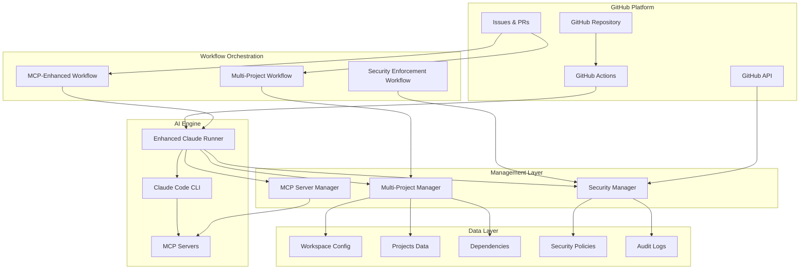
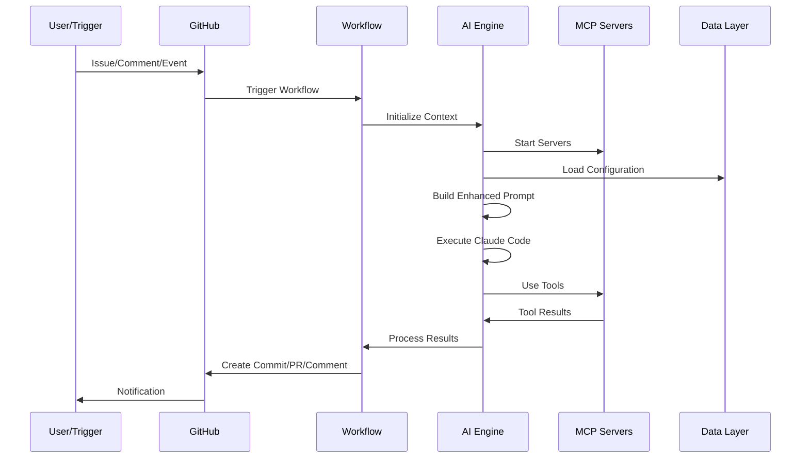
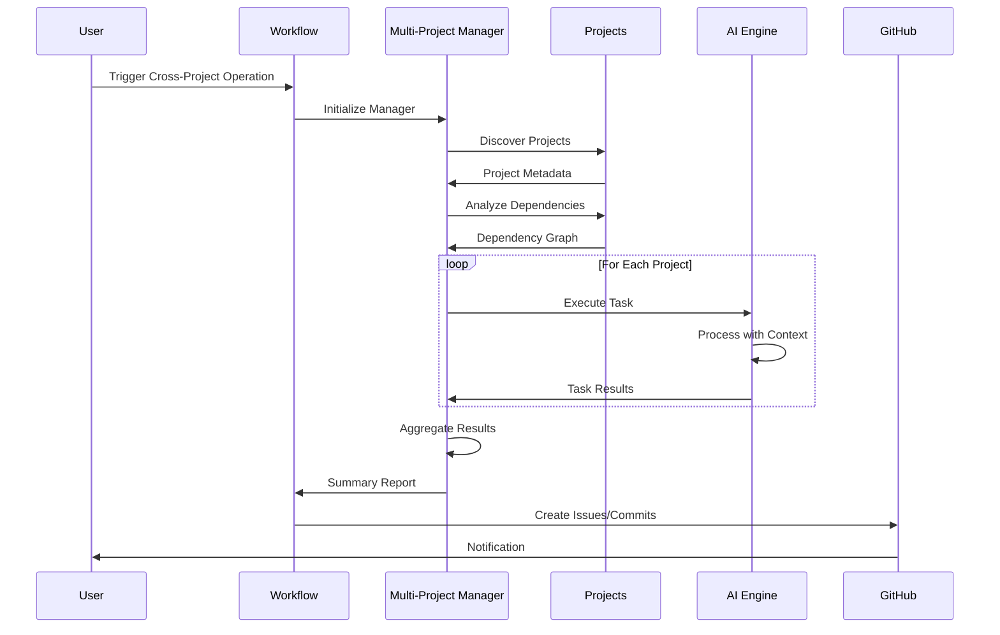
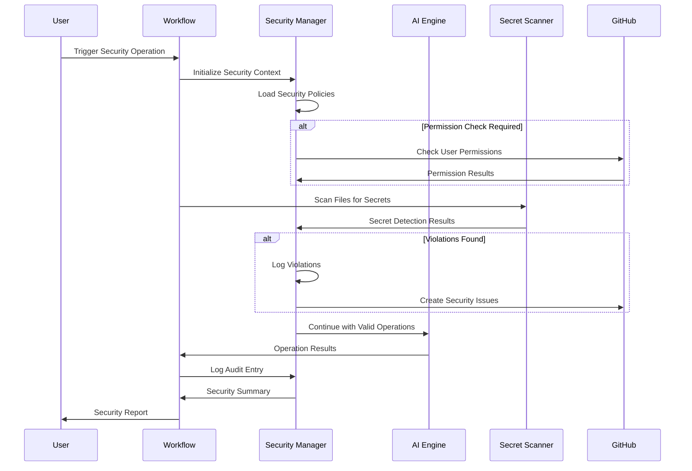
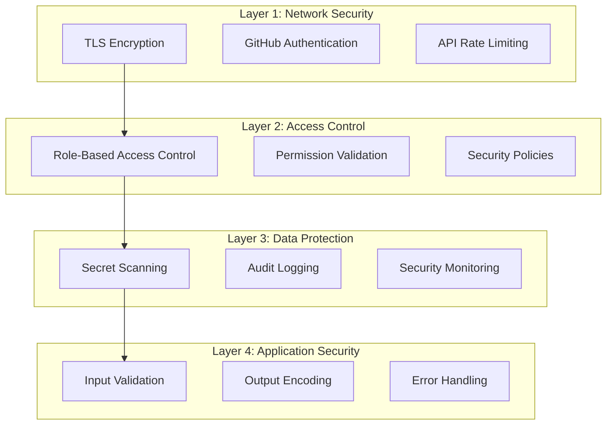

# AI Automation System Architecture Overview

## 🏗️ System Architecture

The AI automation system is a comprehensive, multi-layered architecture that integrates Claude Code CLI with GitHub Actions, MCP servers, and advanced management capabilities.



## 🔄 Component Interactions

### 1. Trigger Layer
- **GitHub Events**: Issues, PRs, pushes, schedules
- **Manual Triggers**: Workflow dispatch, slash commands
- **Automated Triggers**: CI failures, security violations

### 2. Orchestration Layer
- **Workflow Management**: GitHub Actions workflows
- **Task Routing**: Direct requests to appropriate handlers
- **Context Management**: Maintain operation context

### 3. Processing Layer
- **AI Operations**: Claude Code CLI execution
- **MCP Integration**: External tool access
- **Multi-Project Management**: Cross-project operations
- **Security Enforcement**: Policy validation and monitoring

### 4. Data Management Layer
- **Configuration**: Policies, settings, workspace config
- **State Management**: Project status, dependencies
- **Audit & Logging**: Security events, operation history

---

## 🎯 Core Components

### Claude Code Integration

#### Enhanced Claude Runner
```python
class EnhancedClaudeRunner:
    """Enhanced Claude Code runner with MCP integration"""

    async def execute_task(self, request: TaskRequest) -> Dict[str, Any]:
        # 1. Start MCP servers
        await self.mcp_manager.start_all_enabled_servers()

        # 2. Build enhanced prompt
        prompt = self._build_enhanced_prompt(request, mcp_tools)

        # 3. Execute Claude Code
        results = await self.claude_runner.run_claude_command(prompt, options)

        # 4. Process results with context
        return self._process_results(results, request)
```

#### MCP Server Manager
```python
class MCPServerManager:
    """Manages MCP server lifecycle and health"""

    async def start_server(self, server_name: str) -> bool:
        # 1. Load server configuration
        # 2. Prepare environment variables
        # 3. Start server process
        # 4. Verify health and connectivity
        # 5. Register available tools
```

### Multi-Project Management

#### Project Discovery
```python
def _discover_projects(self):
    """Automatically discover projects in workspace"""
    for root, dirs, files in os.walk(self.workspace_root):
        for language, indicators in project_indicators.items():
            if any(indicator in files for indicator in indicators):
                project = self._create_project_context(root, language)
                self.projects[project.name] = project
```

#### Dependency Analysis
```python
def _analyze_dependencies(self):
    """Analyze cross-project dependencies"""
    for project in self.projects.values():
        # Code dependencies (imports, requires)
        self._analyze_code_dependencies(project)

        # Build dependencies (local packages)
        self._analyze_build_dependencies(project)

        # Test dependencies (cross-project testing)
        self._analyze_test_dependencies(project)
```

### Security Management

#### Policy Enforcement
```python
def check_operation_allowed(self, context: SecurityContext, policy_name: str):
    """Check if operation complies with security policy"""
    policy = self.policies[policy_name]

    # 1. Verify user permissions
    # 2. Validate operation type
    # 3. Check target paths and patterns
    # 4. Scan for secrets
    # 5. Verify approval requirements
    return is_allowed, violations
```

#### Secret Detection
```python
def _scan_file_for_secrets(self, file_path: str) -> List[str]:
    """Scan file for potential secrets"""
    for pattern in self.secrets_patterns:
        matches = pattern.findall(content)
        if matches:
            secrets.extend([self._mask_secret(match) for match in matches])
    return secrets
```

---

## 🔄 Workflow Architecture

### 1. MCP-Enhanced Workflow
```yaml
# claude-code-mcp-enhanced.yaml
on:
  issues:
    types: [labeled]
  issue_comment:
    types: [created]
  workflow_dispatch:
  workflow_run:
    workflows: ["CI", "Python CI", "C++ CI"]
    types: [failed]
  pull_request:
    types: [opened, synchronize, reopened]

jobs:
  ai-automation:
    steps:
      - name: Parse trigger and determine task
      - name: Discover projects
      - name: Run AI task with MCP integration
      - name: Process AI results and create commit
      - name: Run validation tests
      - name: Push changes
```

### 2. Multi-Project Workflow
```yaml
# multi-project-automation.yaml
on:
  workflow_dispatch:
    inputs:
      operation: [workspace-analysis, cross-project-sync, dependency-audit]
  schedule:
    - cron: '0 2 * * 1'  # Weekly analysis
  issue_comment:
    types: [created]

jobs:
  multi-project-analysis:
    steps:
      - name: Generate workspace report
      - name: Analyze dependencies
      - name: Get project hierarchy
      - name: Create summary dashboard

  cross-project-operations:
    steps:
      - name: Execute cross-project task
      - name: Process results and create commits
      - name: Create summary
```

### 3. Security Enforcement Workflow
```yaml
# security-enforcement.yaml
on:
  workflow_dispatch:
    inputs:
      operation: [scan-secrets, audit-repo, check-permissions]
  push:
    branches: [main, develop]
  pull_request:
    branches: [main]
  schedule:
    - cron: '0 3 * * *'  # Daily security scans

jobs:
  security-scan:
    steps:
      - name: Scan for secrets in code
      - name: Parse secrets scan results
      - name: Create security issues for high-risk secrets

  permission-audit:
    steps:
      - name: Check repository permissions
      - name: Security policy validation

  security-report:
    steps:
      - name: Generate security summary
      - name: Create security dashboard
```

---

## 📊 Data Flow Architecture

### 1. Request Processing Flow


### 2. Multi-Project Operation Flow


### 3. Security Enforcement Flow


---

## 🗄️ Data Architecture

### 1. Configuration Data

#### Workspace Configuration
```json
{
  "name": "workspace-name",
  "description": "Workspace description",
  "default_branch": "main",
  "shared_tools": ["pytest", "eslint"],
  "global_configs": {
    "python_version": "3.11",
    "node_version": "18"
  },
  "ci_templates": {
    "python": ".github/workflows/python-ci.yaml"
  }
}
```

#### Security Policies
```json
{
  "policy_name": {
    "description": "Policy description",
    "security_level": "internal",
    "required_permissions": ["write"],
    "allowed_operations": ["read_file", "write_file"],
    "restricted_patterns": [".*\\.key$"],
    "max_file_size_mb": 50,
    "secret_detection_enabled": true,
    "audit_logging": true
  }
}
```

#### MCP Server Configuration
```json
{
  "servers": {
    "git": {
      "server_type": "git",
      "command": "npx",
      "args": ["@modelcontextprotocol/server-git"],
      "env": {"GIT_DIR": "${PWD}"},
      "enabled": true,
      "timeout": 30
    }
  }
}
```

### 2. Runtime Data

#### Project Metadata
```json
{
  "project_name": {
    "name": "project-name",
    "path": "./path/to/project",
    "language": "python",
    "build_system": "poetry",
    "test_framework": "pytest",
    "dependencies": ["fastapi", "sqlalchemy"],
    "metrics": {
      "lines_of_code": 15000,
      "test_coverage": 85.5,
      "complexity_score": 42.1
    }
  }
}
```

#### Dependency Graph
```json
{
  "nodes": [
    {"id": "frontend", "language": "javascript"},
    {"id": "backend", "language": "python"}
  ],
  "edges": [
    {
      "source": "frontend",
      "target": "backend",
      "type": "code_dependency",
      "strength": 0.8
    }
  ]
}
```

#### Audit Logs
```json
{
  "timestamp": "2024-10-15T10:30:00Z",
  "user": "username",
  "operation": "modify_code",
  "target": "src/main.py",
  "result": "success",
  "security_level": "internal",
  "details": {
    "mcp_tools_used": ["git_status", "read_file"],
    "project_context": "backend-api"
  }
}
```

---

## 🔒 Security Architecture

### 1. Defense in Depth


### 2. Security Controls

#### Access Control Matrix
| Role | Read | Write | Admin | Security Admin |
|------|------|-------|-------|----------------|
| Public | ✅ | ❌ | ❌ | ❌ |
| Developer | ✅ | ✅ | ❌ | ❌ |
| Maintainer | ✅ | ✅ | ✅ | ❌ |
| Security Admin | ✅ | ✅ | ✅ | ✅ |

#### Security Policy Enforcement
1. **Pre-Operation Checks**
   - User permission validation
   - Operation type authorization
   - Target path validation
   - File size and type checks

2. **Runtime Monitoring**
   - Secret scanning
   - Anomaly detection
   - Real-time violation blocking

3. **Post-Operation Auditing**
   - Comprehensive logging
   - Violation tracking
   - Security metrics collection

---

## ⚡ Performance Architecture

### 1. Optimization Strategies

#### MCP Server Optimization
- **Connection Pooling**: Reuse server connections
- **Tool Caching**: Cache frequently used tool results
- **Parallel Execution**: Run multiple tools concurrently
- **Health Monitoring**: Proactive server health checks

#### Multi-Project Optimization
- **Incremental Analysis**: Only analyze changed projects
- **Parallel Processing**: Process projects concurrently
- **Dependency Caching**: Cache dependency analysis results
- **Smart Scheduling**: Prioritize critical operations

#### Security Optimization
- **Pattern Optimization**: Efficient regex patterns
- **Incremental Scanning**: Only scan changed files
- **Policy Caching**: Cache permission check results
- **Batch Processing**: Group security operations

### 2. Scaling Considerations

#### Horizontal Scaling
- Multiple workflow runners
- Distributed MCP servers
- Load balanced operations
- Fault-tolerant design

#### Vertical Scaling
- Resource allocation optimization
- Memory management
- CPU utilization
- I/O optimization

---

## 🔧 Integration Architecture

### 1. External Integrations

#### GitHub Integration
- **API Access**: Repository management, issue/PR operations
- **Webhooks**: Event-driven triggers
- **Actions**: Workflow orchestration
- **Authentication**: OAuth tokens, permissions

#### Claude Code Integration
- **CLI Interface**: Headless mode execution
- **JSON Streaming**: Structured output processing
- **Context Management**: Project-aware operations
- **Error Handling**: Retry logic and recovery

#### MCP Server Integration
- **Protocol**: Model Context Protocol
- **Tool Discovery**: Dynamic tool registration
- **Health Monitoring**: Server lifecycle management
- **Resource Management**: Connection pooling

### 2. Internal Integrations

#### Component Communication
```python
# Example: Security Manager integration
class SecureClaudeRunner:
    def __init__(self):
        self.claude_runner = EnhancedClaudeRunner()
        self.security_manager = SecurityManager()

    async def execute_secure_task(self, request):
        # 1. Create security context
        context = self._create_security_context(request)

        # 2. Validate operation
        allowed, violations = self.security_manager.check_operation_allowed(
            context, "developer_write"
        )

        if not allowed:
            self.security_manager.log_violation(context, violations)
            return {"success": False, "violations": violations}

        # 3. Execute with monitoring
        result = await self.claude_runner.execute_task(request)

        # 4. Audit the operation
        self.security_manager.log_audit(context, "success", result)

        return result
```

---

## 📈 Monitoring Architecture

### 1. Metrics Collection

#### System Metrics
- MCP server health and performance
- Multi-project operation success rates
- Security violation detection rates
- Workflow execution times

#### Business Metrics
- Developer productivity improvements
- Code quality enhancements
- Security incident reduction
- Automation coverage percentage

### 2. Alerting System

#### Real-time Alerts
- Security violations (high severity)
- MCP server failures
- Workflow execution failures
- Performance degradation

#### Scheduled Reports
- Daily security summaries
- Weekly workspace analytics
- Monthly performance reports
- Quarterly compliance reviews

---

## 🚀 Evolution Architecture

### 1. Extensibility Framework

#### Plugin Architecture
```python
class MCPPlugin:
    """Base class for MCP server plugins"""

    def register_tools(self):
        """Register available tools"""
        pass

    def health_check(self):
        """Perform health check"""
        pass

    def handle_request(self, request):
        """Handle tool request"""
        pass
```

#### Custom Command Framework
```python
class SlashCommand:
    """Base class for custom slash commands"""

    def __init__(self, name, description):
        self.name = name
        self.description = description

    def validate_input(self, input_text):
        """Validate command input"""
        pass

    def execute(self, context, args):
        """Execute command logic"""
        pass
```

### 2. Future Enhancements

#### Advanced AI Features
- Multi-turn conversation support
- Context-aware decision making
- Learning from past operations
- Predictive recommendations

#### Enhanced Security
- Machine learning threat detection
- Behavioral analysis
- Automated security remediation
- Compliance reporting

#### Enterprise Features
- Multi-tenant support
- Advanced analytics
- Custom integrations
- Professional services

---

## 📚 Architecture Principles

### 1. Design Principles
- **Modularity**: Loosely coupled, highly cohesive components
- **Scalability**: Designed for growth and expansion
- **Security**: Security-first design approach
- **Reliability**: Fault-tolerant and resilient
- **Maintainability**: Clean, well-documented code

### 2. Operational Principles
- **Observability**: Comprehensive monitoring and logging
- **Automatability**: Maximum automation with minimal manual intervention
- **Consistency**: Standardized patterns and conventions
- **Recoverability**: Graceful handling of failures
- **Performance**: Optimized for speed and efficiency

### 3. Security Principles
- **Least Privilege**: Minimum necessary permissions
- **Defense in Depth**: Multiple security layers
- **Zero Trust**: Verify everything, trust nothing
- **Auditability**: Complete audit trail
- **Transparency**: Clear security policies and procedures

---

*This architecture provides a robust, scalable, and secure foundation for AI-driven development automation.*